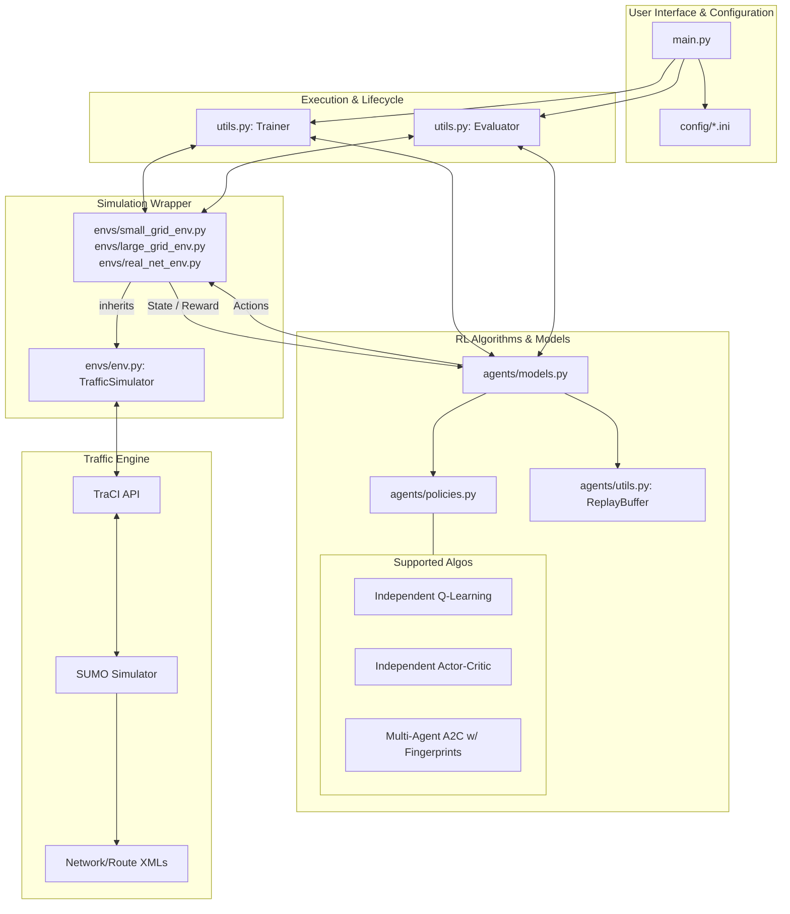

# System Architecture: Deep RL for Traffic Signal Control

This document describes the high-level architecture of the `deeprl-signal-control` project, illustrating how the reinforcement learning (RL) agents interact with the traffic simulation environment.

## 1. High-Level Architecture Diagram

The system follows a modular design with a clear separation between the simulation engine, the RL logic, and the orchestration layer.

## 2. Component Descriptions

### 2.1 Configuration Layer (`config/`)
The system is entirely data-driven. Hyperparameters for the environment (e.g., control interval, objective function) and the RL models (e.g., learning rate, batch size) are defined in `.ini` files.

### 2.2 Orchestration Layer (`main.py` & `utils.py`)
*   **`main.py`**: Acts as the command-line entry point. It handles argument parsing, directory initialization, and switches between `train` and `evaluate` modes.
*   **`Trainer`**: Manages the training loop, collecting experience, performing backward passes (learning), and saving model checkpoints.
*   **`Evaluator`**: Runs the trained models in a test-only mode, often with visualization enabled, to collect performance metrics.

### 2.3 Agent Layer (`agents/`)
*   **Models (`models.py`)**: Implements the logic for various RL algorithms. 
    *   **MA2C**: A specialized algorithm for multi-agent coordination that utilizes "neighbor fingerprints" (previous policies of neighbors) to stabilize the learning environment.
*   **Policies (`policies.py`)**: Contains the neural network architectures. It supports **Fully-Connected (FC)** layers and **Long Short-Term Memory (LSTM)** units to handle temporal dependencies in traffic flow.

### 2.4 Environment Layer (`envs/`)
*   **`env.py` (TrafficSimulator)**: A comprehensive wrapper around the SUMO simulator. It abstracts the low-level TraCI commands into standard RL `reset()` and `step()` functions.
*   **State Extraction**: Captures "wave" (vehicle count) and "wait" (waiting time) vectors from specific lanes.
*   **Reward Computation**: Calculates rewards based on minimizing queue lengths and waiting times, with specialized penalties for emergency vehicle delays.

### 2.5 Simulator Backend (SUMO)
The core traffic physics are simulated by **SUMO (Simulation of Urban MObility)**. The Python layer communicates with SUMO via the **TraCI** (Traffic Control Interface) protocol over a TCP socket.

## 3. Data Flow (Step Loop)
1.  **State**: `TrafficSimulator` queries SUMO for induction loop data and vehicle positions.
2.  **Observation**: The raw data is normalized and augmented with neighbor information (for MA2C) to form an observation vector.
3.  **Action**: The RL `Policy` processes the observation and outputs an action (integer representing a signal phase).
4.  **Transition**: `TrafficSimulator` executes the action by setting signal phases in SUMO (handling yellow-light intervals automatically).
5.  **Reward**: After the simulation steps forward, a reward is calculated based on the new traffic state.
